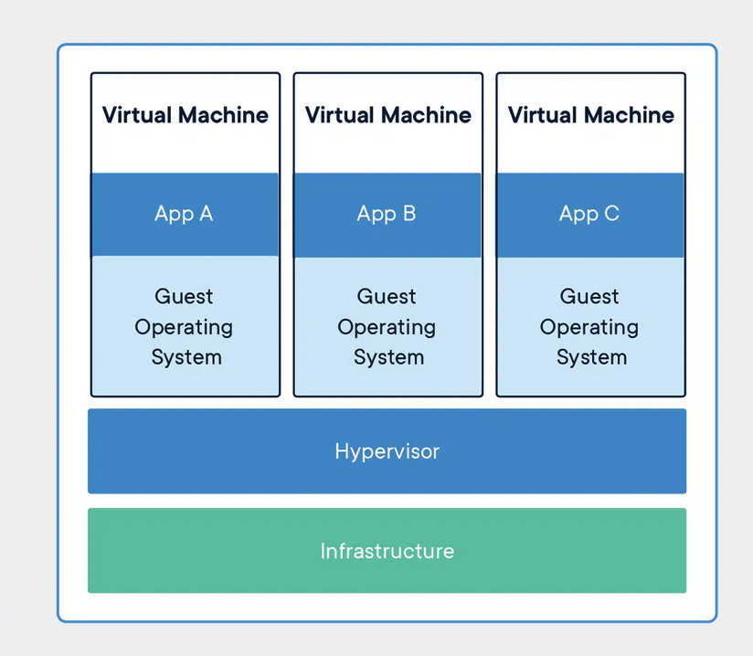
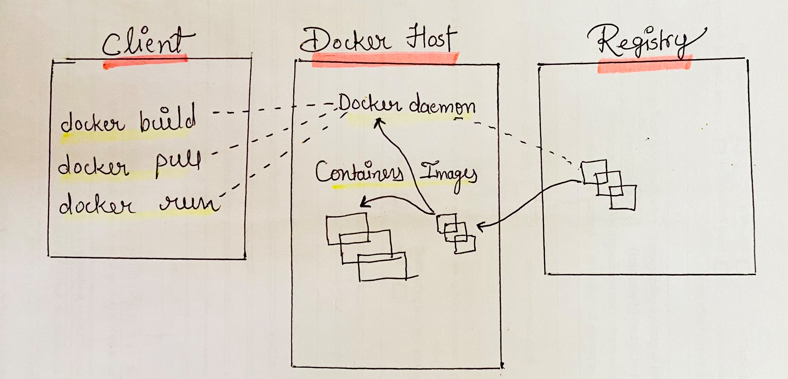
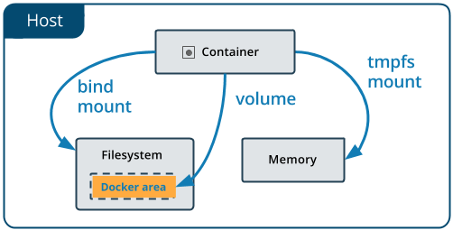

# 🧱  Virtualization 

Virtualization allows multiple operating systems or environments to run on a single physical machine by abstracting hardware resources.



#LLimitations of virtualization
Each VM includes a full guest OS
→ Leads to large image sizes.

Higher resource usage
→ More CPU, RAM, and disk required per VM.

Slower startup time
→ Booting a full OS takes minutes.

# This is where Docker comes into action ✅ 
Docker overcomes these limitations by using container-based virtualization:
+ No need for a full OS per application
+ Lightweight and faster
+ Better resource efficiency

# Virtual Machine 💻
A virtual machine (VM) is a virtual environment that functions as a virtual computer system with its own CPU, memory, network interface, and storage, created on a physical hardware system (located off- or on-premises).

# Docker 🦈
Docker is an open source containerization platform for building, deploying, and managing containerized applications. It enables to package applications into containers that encapsulate source code, libraries and dependencies required to run that code in any environment.

# Docker Architecture 
Docker works on a simple client-server model where the Docker client is like a remote control that you use to give commands (docker run, docker build), and the Docker daemon (server) is the engine that does the real work of building images, running containers, and managing them. The client and daemon talk to each other using a REST API, either through UNIX sockets (if on the same machine) or over a network (if on different machines). On top of this, Docker Compose is another client tool that makes it easy to run applications made up of multiple containers together, using just one configuration file instead of starting each container manually.



# Containers

A container is a standard unit of software that packages up code and all its dependencies so the application runs quickly and reliably from one computing environment to another. Containers share the machine's OS system Kernel and therefore do not require an OS per application.

# Why Docker?

+ Lightweight
+ Isolation
+ Scalability
+ Performance
+ Portability

# Docker Engine
Docker Engine is an open source containerization technology for building and containerizing your applications. Docker Engine acts as a client-server application.

# Install Docker

https://docs.docker.com/get-docker/

By default only root user can execute docker commnads but if other users want permission to run docker commands.

Add the users into docker group: /etc/group/
```
sudo usermod -aG docker user
```

# Docker Hub
Docker Hub is a service provided by Docker for finding and sharing container images with your team. It's world’s largest repository of container images with an array of content sources including container community developers, open source projects and independent software vendors (ISV) building and distributing their code in containers.

https://hub.docker.com/

# Docker Image
A Docker image is a file used to execute code in a Docker container. Docker images act as a set of instructions to build a Docker container, like a template. Docker images also act as the starting point when using Docker.

# Docker-commands

+ List running container :
```
docker ps
```
+ List all container even exited one :
```
docker ps -a
```
+ Stop Container use Id/conatiner name :
```
docker stop container name/container Id
```
+ List all docker Images :
```
docker images
```
+ Remove docker images :
```
docker rmi image-name
```
+ Run Docker Image :
```
docker run image-name
```
+ Run Docker Image and give name to it :
```
docker run --name myImage image-name
```
+ Run Docker Image and map it to host port:
```
docker run -p host-port:container-port image-name
```
+ Pull image from docker hub :
```
docker pull image-name
```
+ Execute command in docker container :
```
docker exec image-name cat /etc/os-release
```
+ Run image in detach mode :
```
docker run -d image-name
```
+ Run image in attach mode :
```
docker attach id
```
+ Run particular version of an image :
```
docker run image-name:tag
```
+ Run image in interactive mode :
```
docker run -i image-name
```
+ Remove container :
```
docker rm container-id
```
+ Volume mapping :
```
docker run -v /opt/backup_dir:/var/lib/jenkins jenkins
```
+ Inspect container :
```
docker inspect container-name
```

# Docker Logs:

you can check if container is nor running or there is some error.

+ Container logs :
```
docker logs container-name/container-id
```

# Create your own image

+ We can create our image using Dockerfile
+ Define steps
+ Build image (docker build)

```
Dockerfile build -t docker_hub_username/application-name
```

# Dockerfile Instructions

**FROM** - Take Base Image (Take from docker hub)

**LABELS** - Key value pairs, give project name or author name

**RUN** - Execute commands

**ADD/COPY** - Add files and folders into image

**ENTRYPOINT** - Allows you to configure a container that will run as an executable

**VOLUME** - Creates a mount point and marks it as holding externally mounted volumes

**EXPOSE** - Container listens on the specific network ports at runtime

**ENV** - To set an environmemt variable

**USER** - Sets the username

**WORKDIR** - Sets the working directory

**ARG** - Define a variables that user can pass at build time

**ONBUILD** - Adds to the image trigger instruction to be executed at a later time

+ Push Image
```
docker push docker_hub_username/application-name
```

# Docker Volumes:
The data doesn't persist when container is not running. Docker has two options to persist data in the host machine.

**Volumes**
Managed by docker(/var/lib/docker/volumes/ on Linux)



**Example of voume creation**
```
docker volume create myContainerData
```
```
docker run --name myWebService -d -p 8080:8080 -v myContainerData:/var/lib/image-name image-name:tag
```
+ Find your container data in /var/lib/docker/volumes/myContainerData/_data/

**Bind Mounts:**

Stored anywhere in the host system.

**Example of bind mounts**

```
docker run --name myWebService -d -p 8080:8080 -v /home/ubuntu/myContainerData:/var/lib/image-name image-name:tag
```

# Docker Compose

Docker Compose is a tool that was developed to help define and share multi-container applications. With Compose, we can create a YAML file to define the services and with a single command, can spin everything up or tear it all down.
